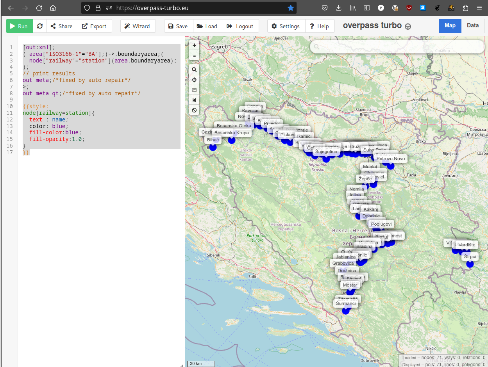
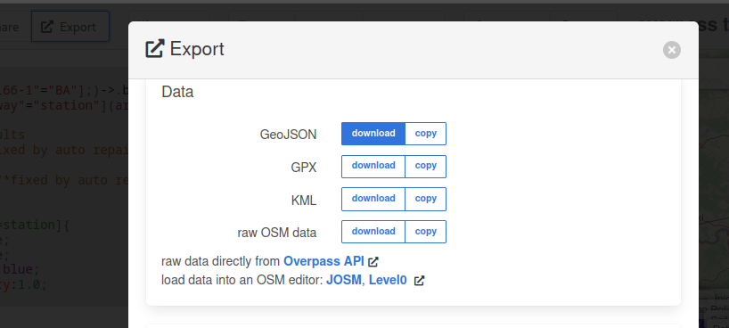

# Bahnhofsdaten

**Repository moved to https://codeberg.org/RailwayStations/Bahnhofsdaten**

A collection of country data for https://map.railway-stations.org

## Add a new country

Example for country "Bosnia and Herzegovina".

### Insert a new entry in the countries table:

```sql
INSERT INTO countries (id,name,timetableUrlTemplate,email,overrideLicense,active) VALUES
	 ('ba','Bosnia and Herzegovina',NULL,'info@railway-stations.org','CC_BY_NC_40_INT',1);

```

### Extract railway stations from OpenStreetmap

You can extract railway stations from OpenStreetmap via https://overpass-turbo.eu/

Use a query like this and change the two-letter country code (upper case `BA` in this case) for the `area` function:

```
[out:xml];
( area["ISO3166-1"="BA"];)->.boundaryarea;(
  node["railway"="station"](area.boundaryarea);
);
// print results
out meta;/*fixed by auto repair*/
>;
out meta qt;/*fixed by auto repair*/

{{style:
node[railway=station]{ 
  text : name;
  color: blue;
  fill-color:blue;
  fill-opacity:1.0;
}
}}
```



### Export the result as geojson



### Convert geojson to sql

Use `jq` to transform the geojson file to an sql script. Change the filenames and the two-letter country code (lower case `ba` in the example) to the appropriet one for the new country.

```bash
cat BosniaHerzegovina.geojson | jq -r '.features | to_entries[] | [.key+1, .value.properties.name, .value.geometry.coordinates[0], .value.geometry.coordinates[1]] | @text "insert into stations (countryCode, id, title, lat, lon) values ('"'"'ba'"'"', '"'"'\(.[0])'"'"', '"'"'\(.[1])'"'"', \(.[3]), \(.[2]));"' > BosniaHerzegovina.sql

```

For countries with non-latin station names we could check for `int_name` and `name:en` properties and prepend them:

```bash
cat Ukraine.geojson | jq -r '.features | to_entries[] | [.key+1, if (.value.properties.int_name != null) then .value.properties.int_name + " (" + .value.properties.name + ")" elif (.value.properties.["name:en"] != null) then .value.properties.["name:en"] + " (" + .value.properties.name + ")" else .value.properties.name end, .value.geometry.coordinates[0], .value.geometry.coordinates[1]] | @text "insert into stations (countryCode, id, title, lat, lon) values ('"'"'ua'"'"', '"'"'\(.[0])'"'"', '"'"'\(.[1])'"'"', \(.[3]), \(.[2]));"' > Ukraine.sql

```

Finally run the sql script in database.

If you are an external contributor we are happy to receive Pull Requests with the sql file.
